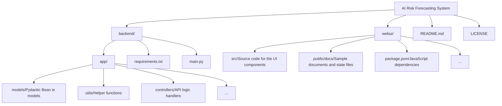

#  AI Risk Forecasting System

**An Advanced Platform for Comprehensive Predictive Risk Analysis using LLMs and Structured Data.**

[](LICENSE)
[]()
[](#backend)
[](#webui)

##  Overview

The AI Risk Forecasting System is a full-stack application designed to automate and enhance the process of enterprise risk assessment. By combining large language models (LLMs) with structured document processing, data ingestion pipelines, and advanced analytical models, the platform allows users to upload various forms of risk-related documentation (PDFs, DOCX, XLSX, etc.) and receive comprehensive, contextualized, and predictive risk forecasts.

It moves beyond simple data aggregation by performing deep document understanding, identifying critical linkages, and generating actionable insights and reports.

##  Key Features

*   **Intelligent Document Ingestion:** Supports multiple file formats including `.docx`, `.pdf`, `.xlsx`, and `.csv`.
*   **Multi-Modal Data Processing:** Integrates advanced parsers for handling text, structured tables, and key-value data from various sources.
*   **Generative AI Analysis (LLM-Powered):** Uses Retrieval-Augmented Generation (RAG) techniques to ground analytical responses in the uploaded corporate documentation, ensuring accuracy and contextuality.
*   **Stateful Project Management:** Organizes analyses into distinct, trackable `Projects`, managing the full lifecycle from upload to final report generation.
*   **Risk Scoring & Health Metrics:** Generates quantitative and qualitative risk scores, visualizing the current health status of the monitored entity.
*   **Automated Reporting:** Creates highly detailed reports, including summarized findings, identified risks, and predicted trends.

##  Architecture

The system follows a modern microservice-like architecture, decoupled into a robust backend API and a responsive frontend user interface.

###  Frontend (`webui`)
Built with **React** and **Vite**, the UI layer provides a rich, intuitive user experience. It handles user interactions, file uploads, and visualization of complex analytical outputs.
*   **Dependencies:** `react-markdown`, `papaparse`, `html2pdf.js`, etc.
*   **API Endpoint:** Communicates with the backend API at `http://127.0.0.1:3000/v1/api`.

###  Backend (`backend`)
The core intelligence layer, built with **Python** (using libraries like LangChain, Beanie, FastAPI).
*   **Data Modeling:** Uses Pydantic and Beanie for robust database interaction and project management (`Project` model).
*   **Ingestion Pipeline:** Manages the workflow (Upload -> Indexing -> Analysis) for all uploaded content.
*   **API Functions:** Exposes controlled endpoints for document submission, project status querying, and fetching analytical results.

##  Getting Started

Please follow the setup steps for both the backend and the frontend in sequence.

###  Prerequisites

*   Node.js and npm (for the `webui`)
*   Python 3.10+ (for the `backend`)
*   A local database instance (e.g., MongoDB, as indicated by the `beanie` dependency).

###  1. Backend Setup (Python)

The backend handles data ingestion, AI processing, and data persistence.

1.  **Navigate to the backend directory:**
    ```bash
    cd backend
    ```
2.  **Install Dependencies:**
    ```bash
    pip install -r requirements.txt
    ```
3.  **Set Environment Variables:**
    Create or update the `.env` file in the `backend` directory with necessary credentials (e.g., database URI, API keys).

    > **Example `.env` file: for backend**  
    ```bash
    MONGODB_URI=mongodb://localhost:27017
    DB_NAME=ai_intelligence_risk_advisor
    HF_TOKEN=your_huggingface_token_here 
    GOOGLE_API_KEY=your_google_api_key_here
    NVIDIA_API_KEY=your_nvidia_api_key_here # optional, only if using NVIDIA APIs
    DOCLING_SERVE_ALLOW_EXTERNAL_PLUGINS=true
    TORCH_COMPILE_DISABLE=1
    TORCHINDUCTOR_DISABLE=1
    ```

4.  **Run the Server:**
    ```bash
    # Assuming standard Uvicorn/FastAPI setup
    python ./backend/app/main.py
    ```
    *The API should now be available at `http://127.0.0.1:3000`.*

###  2. Frontend Setup (WebUI)

The frontend provides the user interface for interaction.

1.  **Navigate to the webui directory:**
    ```bash
    cd webui
    ```
2.  **Install Dependencies:**
    ```bash
    npm install
    # or yarn install
    ```
3. **Configure API Endpoint:**
    Update the `.env` file in the `webui` directory to point to the backend API.

    > **Example `.env` file: for webui**  
    ```bash
    VITE_API_BASE_URL=http://127.0.0.1:3000/v1/api
    ```

4.  **Run the Development Server:**
    ```bash
    npm run dev
    ```
    *The UI should open in your browser at `http://localhost:5173` (or similar port).*

##  Project Structure

